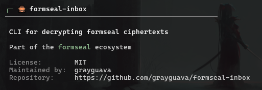

<p align="center">
  
</p>

<p align="center">
  
    
  
  
</p>

<p align="center">
  Decrypt formseal ciphertexts locally.
</p>

---

formseal-inbox decrypts form submissions downloaded by formseal-fetch. Nothing is decrypted in transit or on the server — only the holder of the private key can read submissions.

formseal-inbox is not a hosted service or dashboard. It is a CLI decryption utility.

---

## Installation

**Via pipx (recommended)**

```bash
pipx install formseal-inbox
```

**Via pip**

```bash
pip install formseal-inbox
```

---

## Quick start

```bash
fsi connect
fsi decrypt
fsi status
```

---

## How it works

```
Browser (formseal-embed)
       │
       ▼ (encrypted submissions)
 Your server / endpoint
       │
       ▼ (fsf fetch)
 ciphertexts.jsonl ──► Your PC
       │
       ▼ (fsi decrypt)
 decrypted.jsonl
```

Your backend stores opaque ciphertext only. `fsf fetch` downloads it. `fsi decrypt` decrypts it offline with your private key.

---

## Commands

| Command | Description |
|---------|-------------|
| `fsi` | Show about / info |
| `fsi connect` | Configure source, destination, and private key |
| `fsi decrypt` | Decrypt ciphertexts |
| `fsi status` | Show configuration |
| `fsi disconnect` | Clear credentials |
| `fsi disconnect --wipe` | Clear everything including messages |

Run `fsi --help` for all options.

---

## Security

Your private key never leaves your machine. formseal-inbox:

- Stores credentials in your OS keychain (Windows Credential Manager / macOS Keychain / Linux Secret Service)
- Decrypts locally only
- Sends no telemetry, has no analytics
- Skips already-decrypted messages automatically

---

## Documentation

- [SECURITY.md](./.github/SECURITY.md) — Security policy

---

Please star the repo if you find formseal-inbox useful.

---

## License

MIT